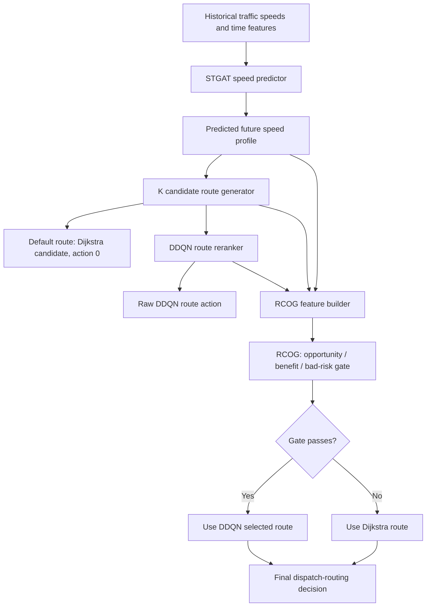

# RCOG, DDQN Routing, and Speed Benchmark Summary

Last updated: 2026-05-22

This note summarizes the current dispatch-routing architecture, the purpose of the DDQN module, the final RCOG gate design, the best RCOG experimental results available so far, and the retained traffic speed prediction benchmark results. It is written as a compact handoff document for paper writing or for another AI assistant to continue from.

## 1. Problem Setting

The system is a taxi intelligent dispatch and route decision framework.

At each dispatch decision time, the system has:

- A directed road/superzone graph.
- A predicted future speed profile from the STGAT speed predictor.
- Dispatch OD pairs from the dispatch module.
- Candidate routes between each OD pair.

The baseline route decision is Dijkstra on the predicted speed graph. This is strong and stable, because if the predicted speeds are accurate and deterministic, Dijkstra is already close to the optimal route under that predicted graph.

The DDQN and RCOG modules are therefore not designed to replace Dijkstra everywhere. Their purpose is narrower:

- DDQN learns a future-value correction under dynamic uncertainty.
- RCOG decides when it is safe and useful to let DDQN override Dijkstra.
- If RCOG does not activate, the system falls back to Dijkstra.

## 2. Architecture Overview



## 3. DDQN Module

### 3.1 Purpose

DDQN is used for candidate-route reranking under uncertain future traffic, not for solving static shortest path globally.

The idea is:

- Dijkstra is optimal for the currently predicted speed graph.
- Future realized traffic may deviate from the predicted graph.
- Some non-Dijkstra candidate routes may become better when future speed changes.
- DDQN learns when a candidate route has higher realized future value than the Dijkstra route.

In plain language, DDQN is trying to answer:

> Given the predicted traffic state and several plausible candidate routes, is one of the non-Dijkstra routes likely to perform better in the realized future?

### 3.2 Action Space

For each OD-time sample, the candidate generator builds K route candidates. In current experiments:

- K = 6.
- Action 0 is the Dijkstra route under predicted speed.
- Actions 1 to 5 are alternative predicted-speed candidate routes.

This is a route-level action space. The agent is not selecting every next road segment globally; it is reranking a fixed candidate set.

### 3.3 State Features

The DDQN state contains:

- Origin and destination IDs.
- Time context such as hour and time slot.
- Dispatch demand/count feature.
- Per-route predicted features:
  - Predicted travel time.
  - Predicted distance.
  - Number of hops.
  - Minimum predicted route speed.
  - Mean predicted route speed.
  - Candidate rank.
  - Predicted time ratio relative to Dijkstra.

The state is based on predicted and historical information available at decision time.

### 3.4 Reward

The reward is computed offline using realized future edge speeds:

```text
reward(action) ~= reward_scale * (Dijkstra_real_time - chosen_real_time) / Dijkstra_real_time
```

Bad route choices can receive extra penalty when the chosen route is much worse than Dijkstra. This makes DDQN less eager to choose risky alternatives.

Important distinction:

- Realized future speeds are used only for training labels and evaluation.
- During deployment, DDQN only sees predicted/historical features.

### 3.5 Why DDQN Alone Is Not Enough

Raw DDQN is too risky if used directly. In the full-year weighted evaluation, raw DDQN had many bad overrides before gating. Therefore, DDQN must be treated as a proposal generator, and RCOG must decide whether to accept or reject the proposed override.

## 4. RCOG Module

RCOG stands for Regret-Calibrated Opportunity Gate.

### 4.1 Purpose

RCOG is a safety and opportunity filter placed after DDQN.

It predicts whether the current OD-time route decision is:

- An opportunity case: Dijkstra is likely not the best candidate under realized future speed.
- A benefit case: the DDQN-selected route is likely better than Dijkstra.
- A bad-risk case: the DDQN-selected route is likely much worse than Dijkstra.

RCOG only allows DDQN to override Dijkstra when the opportunity/benefit evidence is strong enough and the bad-risk estimate is low enough.

### 4.2 Gate Logic

The practical decision rule is:

```text
if DDQN_action != 0 and RCOG_gate_passes:
    use DDQN route
else:
    use Dijkstra route
```

The gate uses a score of the form:

```text
score = P(opportunity) * P(benefit) * (1 - P(bad_override))
```

Then threshold search is performed on validation data with constraints such as:

- bad > 5% must stay below a safety cap.
- activation rate must not be too high.
- benefit precision should stay above a target level when possible.
- balanced objective chooses a practical precision/recall tradeoff.

### 4.3 Why RCOG Is Deployable

RCOG does not need future realized speeds at inference time.

At deployment, it uses:

- STGAT predicted speeds.
- Candidate route features.
- DDQN Q-value summaries and margins.
- Historical/route-level uncertainty features.

Future realized speeds are only used during offline training/evaluation to define labels and compute metrics.

### 4.4 Metric Definitions

- `total_cost_ratio`: total travel cost of the selected policy divided by Dijkstra total cost. Lower than 1 is better.
- `mean_ratio`: mean selected-route time divided by Dijkstra time. Lower than 1 is better.
- `total_cost_improvement_pct`: `(1 - total_cost_ratio) * 100`.
- `benefit_precision`: among activated DDQN overrides, the weighted percentage that truly improve over Dijkstra by the benefit threshold.
- `benefit_recall`: among truly beneficial DDQN overrides, the weighted percentage captured by RCOG.
- `opportunity_precision`: among activated overrides, the weighted percentage that are opportunity cases.
- `opportunity_recall`: among opportunity cases, the weighted percentage activated by RCOG.
- `bad_gt_5pct`: weighted percentage of decisions where the selected route is more than 5% worse than Dijkstra.
- `activation_rate`: weighted percentage of decisions where RCOG accepts DDQN instead of falling back to Dijkstra.
- `opportunity_total_cost_ratio`: total cost ratio measured only on opportunity cases.

## 5. Best RCOG Results for Paper Use

There are two useful result blocks. Use them for different claims.

### 5.1 Best RCOG Search Result

This is the current best selected RCOG variant from the refined safety search.

Source:

```text
D:\STDR\runs\rcog_safety_refined_confirm_cap030_20260521_033445
```

Variant:

```text
cap0.30_act11_prec64_balanced_bw2.0
```

Protocol:

- 5 seeds: 121, 122, 123, 124, 125.
- Bootstrap training resampling.
- Safety cap: bad > 5% target cap 0.5%, selected cap 0.30%.
- Max activation: 11%.
- Minimum benefit precision search target: 64%.
- Objective: balanced.

| Metric | Value |
|---|---:|
| mean ratio | 0.998329 |
| mean improvement | 0.1671% |
| benefit precision | 64.03% |
| benefit recall | 61.40% |
| bad > 5%, mean | 0.2867% |
| bad > 5%, max over seeds | 0.3333% |
| activation rate | 9.63% |
| opportunity-only ratio | 0.983867 |
| opportunity-only improvement | 1.6133% |
| opportunity recall | 52.11% |
| non-opportunity ratio | 1.000542 |
| non-opportunity overhead | 0.0542% |
| minimum bootstrap CI lower bound for improvement | 0.07897% |
| safety pass | Yes |
| positive CI pass | Yes |

Suggested paper wording:

> RCOG selectively activates the DDQN route correction on a small subset of uncertain routing cases. Under the refined safety configuration, RCOG achieves a mean ratio of 0.998329, corresponding to a 0.1671% average improvement over Dijkstra, while keeping the mean bad-over-5% rate at 0.2867% and the maximum seed-level bad-over-5% rate at 0.3333%. On opportunity cases, RCOG reduces route cost by 1.6133%, showing that most of the benefit is concentrated in cases where the predicted-speed Dijkstra route is vulnerable to future traffic uncertainty.

### 5.2 Full-Year OD-Time Weighted Evaluation

This is the most realistic distributional evaluation because it covers the full OD-time dispatch distribution rather than a filtered or selected subset.

Source:

```text
D:\STDR\runs\rcog_full_year_od_weighted_20260522_034144
```

Protocol:

- 5 seeds: 121, 122, 123, 124, 125.
- Full train/val/test OD-time records.
- Dispatch-count weighted metrics.
- No filtering by route length or unique route count:
  - `min_unique_routes = 1`
  - `min_pred_hops = 0`
  - `min_pred_distance_km = 0`
- Coverage: 100% by OD-time pairs and dispatch weight.

| Split | Records | Dispatch Weight | Coverage |
|---|---:|---:|---:|
| train | 163,318 | 21,005,212 | 100% |
| validation | 28,873 | 3,785,171 | 100% |
| test | 48,888 | 6,083,740 | 100% |
| full year | 241,079 | 30,874,123 | 100% |

Aggregate test metrics:

| Metric | Value |
|---|---:|
| test total cost ratio | 0.999198 |
| test total cost improvement | 0.08023% |
| test mean ratio | 0.999772 |
| benefit precision | 46.68% |
| benefit recall | 48.47% |
| bad > 5%, mean | 0.1293% |
| bad > 5%, max over seeds | 0.1454% |
| activation rate | 2.22% |
| opportunity precision | 59.18% |
| opportunity recall | 46.66% |
| test opportunity-only ratio | 0.981935 |
| test opportunity-only improvement | 1.8065% |
| test non-opportunity ratio | 1.000578 |
| full-year total cost ratio | 0.999098 |
| full-year total cost improvement | 0.09024% |
| full-year opportunity precision | 60.97% |
| full-year opportunity recall | 47.24% |
| minimum bootstrap CI lower bound for improvement | 0.05322% |
| safety pass | Yes |
| positive CI pass | Yes |

Suggested paper wording:

> On the full-year OD-time weighted dispatch distribution, RCOG covers 241,079 OD-time records and 30.87 million dispatch-weighted decisions with no filtering. The method achieves a test total cost ratio of 0.999198, equivalent to a 0.08023% global improvement. Although the global number is diluted by the dominance of ordinary non-opportunity cases, the opportunity-only subset shows a 1.8065% cost reduction, while the mean bad-over-5% rate remains only 0.1293%. This supports the interpretation that RCOG is a selective uncertainty-aware correction module rather than a universal replacement for Dijkstra.

## 6. Speed Prediction Experiments

All speed prediction metrics below are test-set results. Each cell is:

```text
MSE / RMSE / MAE
```

Lower is better.

Important note: the six benchmark methods are paper-inspired adapters implemented under this repository's common data protocol, not official reproductions unless separately stated.

### 6.1 My STGAT Speed Model

Source:

```text
D:\STDR\runs\final_dc_v_export_20260514_134425\checkpoints
```

| Dataset | 15 min | 30 min | 60 min |
|---|---:|---:|---:|
| NYC STGAT | 3.544 / 1.883 / 1.072 | 3.606 / 1.899 / 1.072 | 3.568 / 1.889 / 1.080 |
| METR-LA STGAT | 25.460 / 5.046 / 2.879 | 35.015 / 5.917 / 3.311 | 46.340 / 6.807 / 3.830 |
| PEMS-BAY STGAT | 6.908 / 2.628 / 1.331 | 11.622 / 3.409 / 1.647 | 15.997 / 4.000 / 1.947 |

### 6.2 NYC Six Benchmark Methods

Source:

```text
D:\STDR\runs\paper_speed_benchmarks\nyc_paper7_full_20260515_155419\paper7_summary.csv
```

| Model | 15 min | 30 min | 60 min |
|---|---:|---:|---:|
| ASTGNN-LTD | 8.981 / 2.997 / 1.445 | 8.911 / 2.985 / 1.458 | 9.117 / 3.019 / 1.491 |
| ICST-DNET | 5.455 / 2.336 / 1.293 | 5.490 / 2.343 / 1.288 | 5.984 / 2.446 / 1.358 |
| 3S-TBLN | 9.629 / 3.103 / 1.638 | 9.681 / 3.111 / 1.660 | 9.994 / 3.161 / 1.725 |
| MVSTGCN | 4.880 / 2.209 / 1.224 | 4.795 / 2.190 / 1.215 | 5.405 / 2.325 / 1.303 |
| NexuSQN | 4.589 / 2.142 / 1.181 | 5.173 / 2.274 / 1.227 | 5.194 / 2.279 / 1.243 |
| SGSL-GAT-NLSTM | 6.027 / 2.455 / 1.368 | 6.271 / 2.504 / 1.396 | 6.839 / 2.615 / 1.474 |

NYC takeaway:

- The retained six benchmark methods do not strictly beat the STGAT speed model on NYC.
- STGAT is strongest among the retained comparison set on NYC across the reported 15/30/60 min horizons.

### 6.3 METR-LA Six Benchmark Methods

Source:

```text
D:\STDR\runs\paper_speed_benchmarks\la_bay_paper7_full_20260515_195807\paper7_la_bay_summary.csv
```

| Model | 15 min | 30 min | 60 min |
|---|---:|---:|---:|
| ASTGNN-LTD | 26.983 / 5.195 / 2.841 | 39.095 / 6.253 / 3.335 | 54.548 / 7.386 / 4.002 |
| ICST-DNET | 24.878 / 4.988 / 2.807 | 34.114 / 5.841 / 3.250 | 45.212 / 6.724 / 3.760 |
| 3S-TBLN | 27.125 / 5.208 / 2.957 | 39.462 / 6.282 / 3.562 | 55.640 / 7.459 / 4.342 |
| MVSTGCN | 24.637 / 4.964 / 2.841 | 33.787 / 5.813 / 3.279 | 44.712 / 6.687 / 3.782 |
| NexuSQN | 23.413 / 4.839 / 2.775 | 31.769 / 5.636 / 3.131 | 42.355 / 6.508 / 3.582 |
| SGSL-GAT-NLSTM | 25.375 / 5.037 / 2.860 | 34.752 / 5.895 / 3.283 | 46.018 / 6.784 / 3.847 |

METR-LA takeaway:

- Several retained benchmark adapters outperform the current STGAT result on METR-LA.
- NexuSQN is the strongest retained method in this local METR-LA table by most reported metrics.

### 6.4 PEMS-BAY Six Benchmark Methods

Source:

```text
D:\STDR\runs\paper_speed_benchmarks\la_bay_paper7_full_20260515_195807\paper7_la_bay_summary.csv
```

| Model | 15 min | 30 min | 60 min |
|---|---:|---:|---:|
| ASTGNN-LTD | 7.814 / 2.795 / 1.379 | 14.515 / 3.810 / 1.784 | 22.759 / 4.771 / 2.229 |
| ICST-DNET | 7.108 / 2.666 / 1.346 | 12.067 / 3.474 / 1.691 | 16.931 / 4.115 / 2.030 |
| 3S-TBLN | 7.804 / 2.794 / 1.401 | 14.660 / 3.829 / 1.833 | 23.216 / 4.818 / 2.322 |
| MVSTGCN | 7.006 / 2.647 / 1.333 | 11.929 / 3.454 / 1.676 | 16.691 / 4.085 / 2.001 |
| NexuSQN | 7.164 / 2.677 / 1.412 | 11.452 / 3.384 / 1.672 | 15.472 / 3.933 / 1.918 |
| SGSL-GAT-NLSTM | 7.347 / 2.710 / 1.362 | 12.444 / 3.528 / 1.711 | 17.410 / 4.172 / 2.057 |

PEMS-BAY takeaway:

- STGAT remains very competitive at 15 min.
- NexuSQN is strongest at 60 min among the retained benchmark adapters.
- No retained method strictly dominates STGAT across all horizons and all three metrics in this PEMS-BAY table.

## 7. Recommended Paper Positioning

For the speed-prediction section:

- Use STGAT as the proposed/base speed predictor.
- Compare against the six retained paper-inspired benchmark adapters.
- Report 15/30/60 min MSE/RMSE/MAE.
- Clearly state that these are local common-protocol adapters unless official code is later substituted.

For the dispatch/RL section:

- Do not claim DDQN replaces Dijkstra globally.
- Claim that DDQN proposes candidate route corrections under dynamic uncertainty.
- Claim that RCOG is the safety-aware selection mechanism that decides when the DDQN correction should be used.
- Emphasize opportunity-subset gains because global gains are diluted by normal OD-time cases where Dijkstra is already adequate.
- Use full-year OD-time weighted results for deployment realism.
- Use refined sampled results to show the best achievable safety/benefit tradeoff under focused opportunity evaluation.

## 8. Key Files

Core implementation:

```text
D:\STDR\candidate_route_reranker_experiment.py
D:\STDR\no_topk_rcog_gate_experiment.py
D:\STDR\rcog_full_year_od_weighted_eval.py
D:\STDR\ddqn_full_year_training_suite.py
D:\STDR\paper_speed_benchmarks\nyc_speed_prediction.py
```

RCOG result sources:

```text
D:\STDR\runs\rcog_safety_refined_confirm_cap030_20260521_033445\rcog_safety_refined_summary.json
D:\STDR\runs\rcog_full_year_od_weighted_20260522_034144\rcog_full_year_od_weighted_summary.json
```

Speed result sources:

```text
D:\STDR\runs\final_dc_v_export_20260514_134425\checkpoints\v_nyc\predictor_test_metrics.json
D:\STDR\runs\final_dc_v_export_20260514_134425\checkpoints\v_metr_la\predictor_test_metrics.json
D:\STDR\runs\final_dc_v_export_20260514_134425\checkpoints\v_pems_bay\predictor_test_metrics.json
D:\STDR\runs\paper_speed_benchmarks\nyc_paper7_full_20260515_155419\paper7_summary.csv
D:\STDR\runs\paper_speed_benchmarks\la_bay_paper7_full_20260515_195807\paper7_la_bay_summary.csv
```
