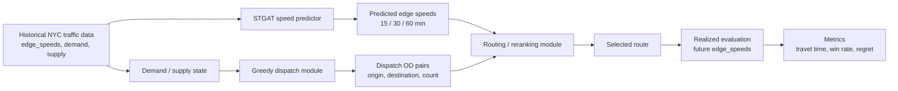
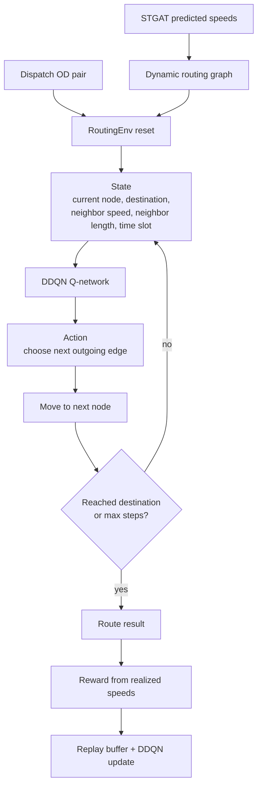
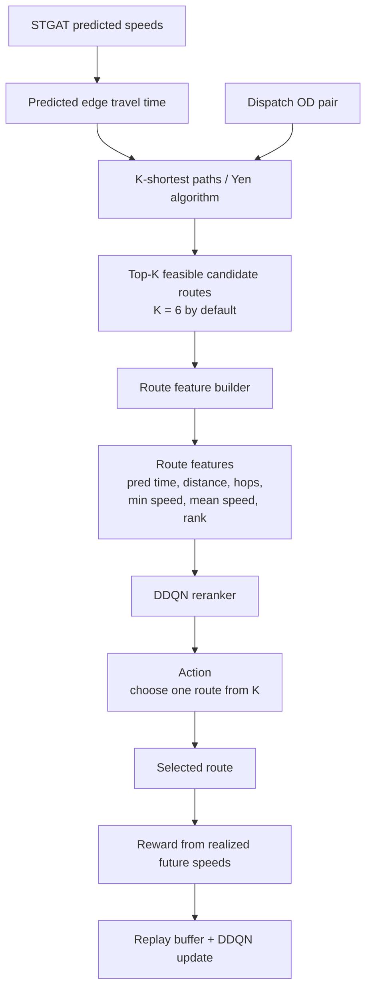
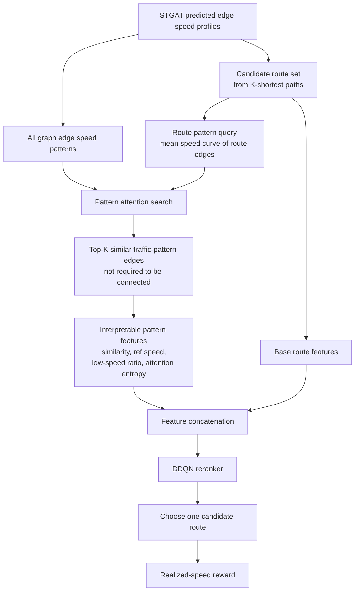
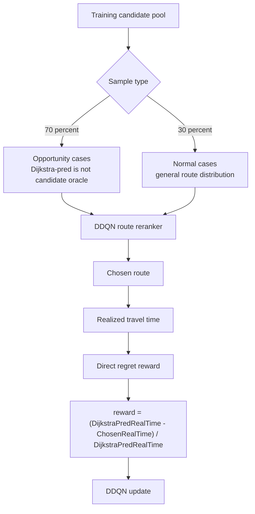
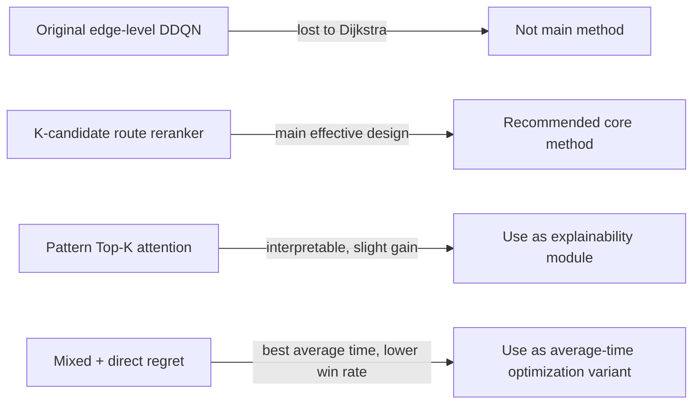

# Dispatch RL Architecture Diagrams

This document summarizes the main dispatch/routing schemes currently implemented in the STDR workspace.

## 0. Overall Taxi Dispatch And Routing Pipeline

Role split:

- Dispatch module: generates vehicle relocation OD pairs from demand/supply imbalance.
- Speed prediction module: predicts future edge speeds.
- Routing/RL module: chooses a route under prediction uncertainty.
- Evaluation: uses realized future speed, not predicted speed.

## 1. Original Edge-Level DDQN Routing

Key point:

- Action is local: choose the next edge.
- It directly competes with Dijkstra.
- In experiments, it learned reachability but did not beat Dijkstra-pred.

## 2. K-Candidate Route DDQN Reranker

Key point:

- Top-K here means Top-K feasible candidate routes.
- Top-K generation is algorithmic, not attention-based.
- DDQN does not build the path edge by edge; it reranks candidate routes.
- This is the main useful RL design found so far.

Main result on unseen opportunity samples:

- Val300: DDQN / Dijkstra-pred = 0.9805
- Test300: DDQN / Dijkstra-pred = 0.9799

## 3. Pattern Top-K Attention Enhanced Reranker

Interpretability:

- The pattern Top-K edges are reference traffic patterns, not route edges.
- They may be spatially disconnected.
- Each decision can report which similar-pattern edges were referenced.

Current effect:

- Base reranker test120: DDQN / Dijkstra-pred = 0.988512
- Pattern Top-K attention test120: DDQN / Dijkstra-pred = 0.988002
- It slightly improves win rate and interpretability, but the average travel-time gain is small.

## 4. Mixed Training + Direct Regret Reward

Purpose:

- Opportunity cases teach the model how to correct Dijkstra-pred failures.
- Normal cases reduce over-specialization to only failure cases.
- Direct regret reward optimizes average realized travel-time improvement.

Current test120 effect:

- Baseline K6 shaped opportunity-only: DDQN / Dijkstra-pred = 0.988512
- Mixed + direct regret: DDQN / Dijkstra-pred = 0.984870
- Extra average improvement over baseline: 0.364 percentage points
- Tradeoff: win rate drops from 73.33 percent to 58.33 percent.

## 5. Current Method Comparison

Recommended paper framing:

- Main method: K-candidate route DDQN reranker.
- Explainability extension: Pattern Top-K traffic-pattern attention.
- Training strategy variant: mixed opportunity/normal training.
- Avoid claiming that RL globally beats Dijkstra on all OD cases.

